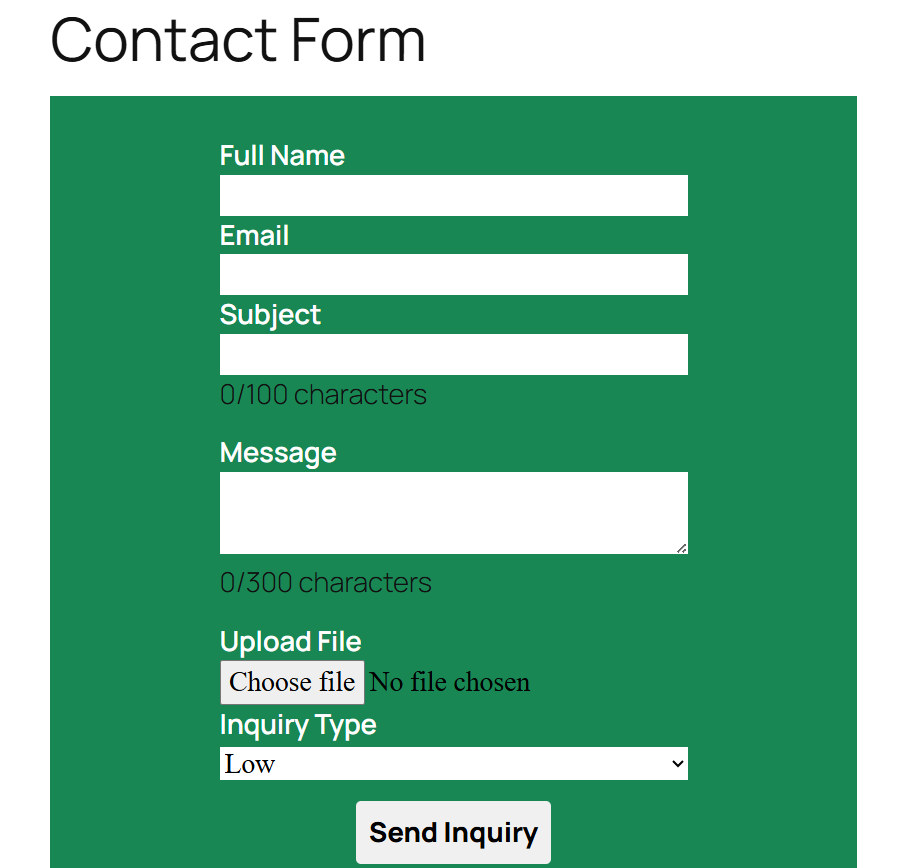
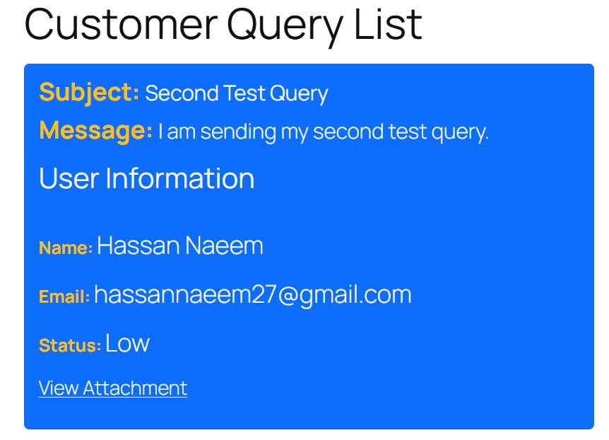

📩 Contact Form Plugin (WordPress)

A custom WordPress Contact Form Plugin that allows users to submit inquiries through a frontend form, upload files, and view submitted queries on a separate page.

This plugin demonstrates core WordPress development concepts including:

Shortcodes

Custom Post Types (CPT)

Form handling

File uploads

Data sanitization & validation

Post meta usage

JavaScript DOM manipulation

🚀 Features
✅ Frontend Contact Form

Collects:

Full Name

Email

Subject

Message

File Upload

Inquiry Type

✅ File Upload Support

Upload files using WordPress upload system

Files are stored in /wp-content/uploads/

Stored as URL in post meta

✅ Custom Post Type (CPT)

Queries are saved as a custom post type:

cf_query_post

Each submission is stored in the WordPress database

✅ Data Storage

Post Title → Subject

Post Content → Message

Post Meta:

Full Name

Email

Inquiry Status

Attachment URL

✅ Frontend Query Display

Displays submitted queries using a shortcode

Clean UI using Bootstrap classes

Attachment links clickable

✅ Security

Nonce verification (wp_nonce_field)

Sanitization:

sanitize_text_field

sanitize_email

sanitize_textarea_field

Validation:

Email validation (is_email)

✅ JavaScript Enhancements (DOM)

Live character counter:

Subject (100 limit)

Message (300 limit)

Input validation feedback

Dynamic styling using class toggling

🛠 Technologies Used
Backend

PHP

WordPress Plugin API

WP_Query

Custom Post Types

Post Meta API

Frontend

HTML

CSS (Bootstrap classes)

JavaScript (Vanilla JS)

WordPress Functions Used

add_shortcode()

register_post_type()

wp_insert_post()

get_post_meta()

wp_handle_upload()

wp_enqueue_script()

wp_enqueue_style()

📦 Installation
Method 1: Manual Installation

Download or clone this repository:

git clone https://github.com/hamza-naeem-dev/WordPress-Contact-Form-Plugin.git

Move the plugin folder to:

wp-content/plugins/

Go to WordPress Admin:

Plugins → Installed Plugins

Activate Contact Form Plugin

🧩 Usage
Display Contact Form

Add this shortcode to any page:

[cf_frontend]
Display Submitted Queries

Add this shortcode to another page:

[cf_query_list]
📁 Plugin Structure
contact-form-plugin/
│
├── contact_form_plugin.php
├── includes/
│   ├── class_contact_form_plugin.php
│   ├── script.js
│   └── style.css
⚙️ How It Works
Form Submission Flow

User fills out the form

Form is submitted via POST

Nonce verification is checked

Inputs are validated & sanitized

File is uploaded using wp_handle_upload()

Data is stored:

Subject → post_title

Message → post_content

Other fields → post_meta

User is redirected to query list page

🧠 Learning Highlights

This plugin demonstrates:

How to build a real WordPress plugin from scratch

Handling frontend forms securely

Working with WordPress database (posts + meta)

Using JavaScript for better UX

Structuring plugin files properly

Integrating PHP + JS in WordPress

📸 Screenshots

⚠️ Future Improvements

Add AJAX form submission (no page reload)

Add admin dashboard UI for queries

Improve UI with custom CSS instead of Bootstrap only

Add success/error messages after submission

Pagination for query list

📌 Author

Hamza Naeem

📄 License

This plugin is licensed under GPL2.

⭐ Final Note

This project is part of my journey to become a WordPress Developer, focusing on:

real-world plugin development

frontend + backend integration

clean and maintainable code
